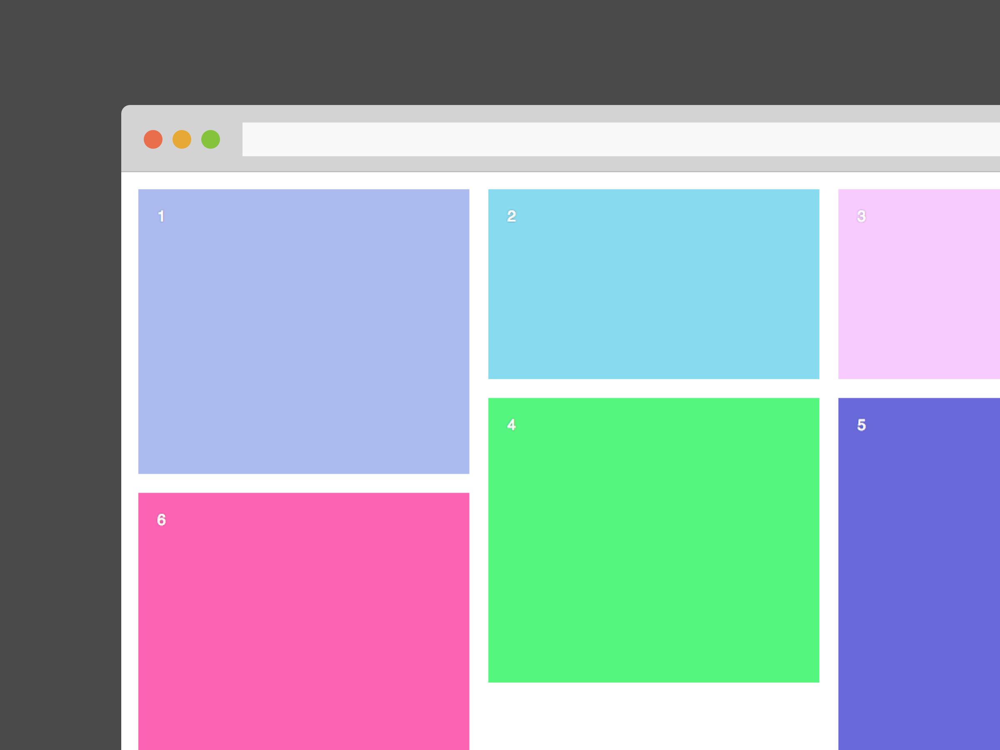

# Masonreact

React component to play with the great library [Masonry](https://github.com/desandro/masonry) from [desandro](https://github.com/desandro).


### Installation

```
npm i -S mansonreact
```

### Usage

You can pass two props to Masonreact : columns numbers `cols` and `margin`.


```js
import React from 'react'
import Masonry from 'masonreact'
import color from 'randomcolor'

const App = () => {

  const style = {
    color: 'white',
    fontFamily: 'Sans-serif',
    textShadow: '0 0 2px rgba(0,0,0,0.5)'
  }

  return (
    <Masonry cols={2} margin={10}>
      <div style={{...style, height: 300, backgroundColor: color()}}>1</div>
      <div style={{...style, height: 200, backgroundColor: color()}}>2</div>
      <div style={{...style, height: 200, backgroundColor: color()}}>3</div>
      <div style={{...style, height: 300, backgroundColor: color()}}>4</div>
      <div style={{...style, height: 400, backgroundColor: color()}}>5</div>
      <div style={{...style, height: 300, backgroundColor: color()}}>6</div>
    </Masonry>
  )
}


export default App
```
### Render


